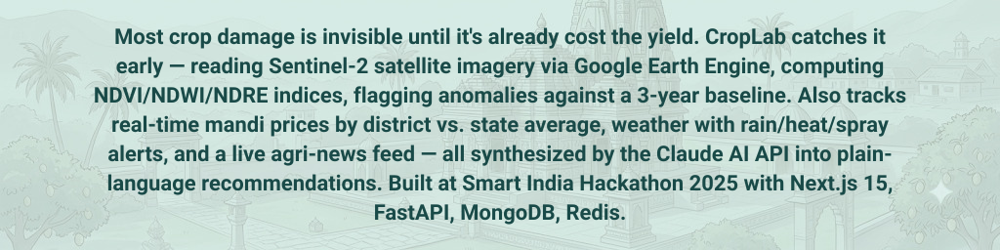
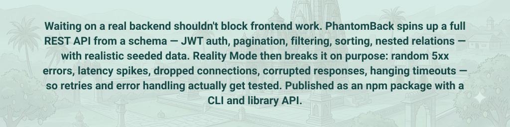

<!-- ============================================================ -->
<!--                     HEADER / BANNER IMAGE                    -->
<!-- ============================================================ -->

  

  

  

<!-- ============================================================ -->
<!--                    COMMIT SNAKE ANIMATION                    -->
<!-- ============================================================ -->

  <picture>
    <source media="(prefers-color-scheme: dark)" srcset="https://raw.githubusercontent.com/madhavxchaturvedi/madhavxchaturvedi/output/github-contribution-grid-snake-dark.svg">
    <source media="(prefers-color-scheme: light)" srcset="https://raw.githubusercontent.com/madhavxchaturvedi/madhavxchaturvedi/output/github-contribution-grid-snake.svg">
    
  </picture>

<!-- ============================================================ -->
<!--                      SOCIAL MEDIA LINKS                      -->
<!-- ============================================================ -->

  
  
  
  
  

 

<!-- Divider -->

  

<!-- ============================================================ -->
<!--                        TECH STACK / SKILLS                   -->
<!-- ============================================================ -->

  

  
  
  
  
  
  
  
  
  
  
  
  
  
  

  
  
  
  
  
  
  
  
  
  
  
  
  
  
  
  
  
  
  

  
  
  
  
  
  
  
  
  
  
  
  

  
  
  
  
  
  
  
  

  
  
  
  
  
  
  
  
  
  
  
  
  
  
  
  
  
  
  
  
  

  
  
  
  

  
  
  
  
  

  
  
  
  
  
  
  
  

  
  
  
  
  

  
  
  
  
  

<!-- Divider -->

  

<!-- ============================================================ -->
<!--                     PROJECT SHOWCASE BLOCK                   -->
<!-- ============================================================ -->

  

<table align="center">
<tbody>
<!-- Project 1 -->
<tr>
<td align="center" width="123"></td>
<td width="700">

 

&nbsp;&nbsp;&nbsp;&nbsp;

</td>
<td align="center" width="123"></td>
</tr>
<!-- Project 2 -->
<tr>
<td align="center" width="123"></td>
<td width="700">

 

&nbsp;&nbsp;&nbsp;&nbsp;

</td>
<td align="center" width="123"></td>
</tr>
<!-- Project 3 -->
<tr>
<td align="center" width="123"></td>
<td width="700">

 

&nbsp;&nbsp;&nbsp;&nbsp;

</td>
<td align="center" width="123"></td>
</tr>
<!-- Project 4 -->
<tr>
<td align="center" width="123"></td>
<td width="700">

 

&nbsp;&nbsp;&nbsp;&nbsp;

</td>
<td align="center" width="123"></td>
</tr>
</tbody>
</table>

 

  

<!-- Divider -->

  

<!-- ============================================================ -->
<!--               STREAK STATS & GITHUB SUMMARY                  -->
<!-- ============================================================ -->

  
  
   
  
  
  

<!-- Divider -->

  

<!-- ============================================================ -->

<!-- ============================================================ -->
<!--                  3D CALENDAR & WAKATIME                      -->
<!-- ============================================================ -->

  <h3>🔥 3D Contribution Calendar</h3>
  <!-- Note: Requires github action to generate 3d graph -->
  <picture>
    
  </picture>

<!-- ============================================================ -->
<!--                            FOOTER                            -->
<!-- ============================================================ -->

 

  

  

 

  

